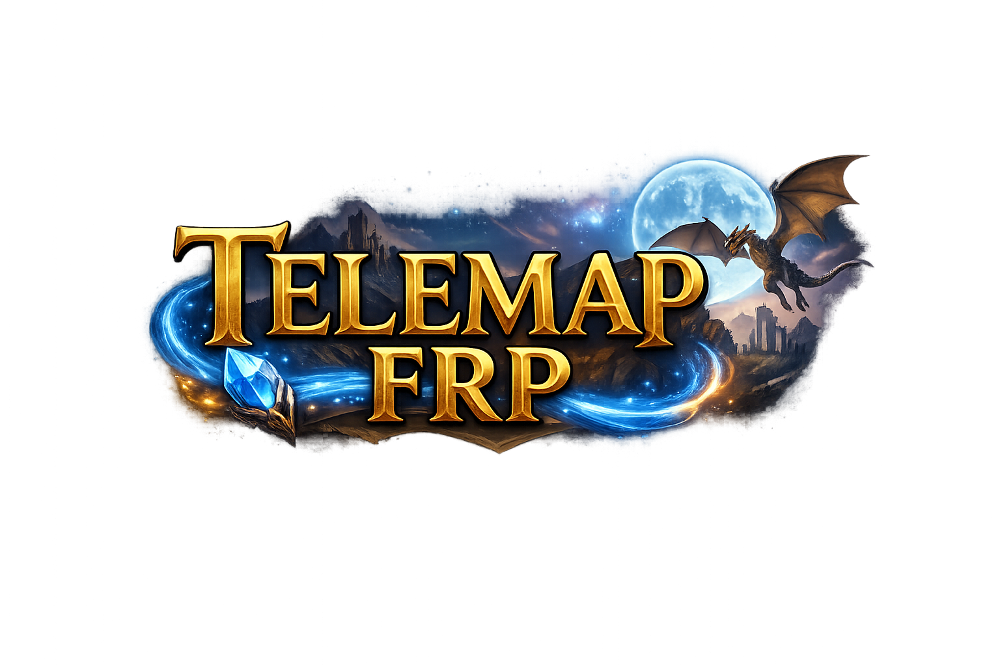

# 🐉 TeleMap FRP - Lightweight Virtual Tabletop (VTT)

<p align="center">
  
</p>

TeleMap FRP is a fast, lightweight, and real-time Virtual Tabletop (VTT) application designed for tabletop role-playing games (like D&D, Pathfinder, etc.). Unlike heavy and complex VTT platforms, it aims to provide only the most essential tools for the Dungeon Master (DM) and players in the most elegant and optimized way possible.

<p align="center">
  
</p>

## ✨ Key Features

*   **🗺️ Dynamic Map & Grid System:** Infinite panning and zooming map infrastructure built with the Leaflet.js engine.
*   **♟️ Smart Token Management:** Easily add tokens to the map. Tokens automatically scale their size according to the map's zoom level, ensuring they never clutter the screen or disappear.
*   **⚔️ Integrated Combat Tracker:** A tracker sliding from the left menu that automatically sorts initiative rolls from highest to lowest, highlights the active character's turn, and syncs in real-time across all clients.
*   **🎲 Advanced Dice Roller & Chat:** A bottom-right chat panel where players can send messages using their custom character names and favorite colors. Includes classic dice rolls as well as modern RPG system mechanics:
    *   Standard dice rolls (e.g., `/r 2d6+3`)
    *   Advantage rolls (e.g., `/adv +2`)
    *   Disadvantage rolls (e.g., `/dis -1`)
*   **💾 Automatic Session Saving:** Map state, token positions, and combat tracker data are instantly saved to the server (`session_save.json`). Even if the server restarts, you can resume exactly where you left off.
*   **⚡ Real-Time Synchronization:** Powered by Socket.io, every action taken by a player (rolling dice, moving tokens, updating the map) is reflected on all players' screens in milliseconds.

## 🛠️ Technologies Used

*   **Frontend:** HTML5, CSS3, Vanilla JavaScript, [Leaflet.js](https://leafletjs.com/)
*   **Backend:** Node.js, Express.js
*   **WebSockets:** [Socket.io](https://socket.io/)

## 🚀 Installation & Usage

Follow these steps to run the project on your local machine or server:

**Clone the Repository**
```bash
git clone https://github.com/ahmetbugrabaydur/TeleMap.git
cd TeleMap
```

## Install Dependencies
Run the following command in the terminal inside the project directory to install Node.js dependencies:

```bash
npm install
```

## Start the Server

```bash
node server.js
```

## Connect to the Game

Open your browser and enter the following in the address bar:

http://localhost:3000

(Note: You may need to use ngrok, port forwarding, or a VPS for other players to connect to your local network.)

## 📖 Dice Commands Guide
You can use the integrated dice roller by typing the following commands into the chat input box:

Command Example	Description
/r 1d20	Rolls a standard 20-sided die.
/roll 2d8+4	Rolls two 8-sided dice and adds 4 to the total.
/adv	Rolls two 20-sided dice and keeps the highest.
/adv +3	Rolls with advantage and adds 3 to the total.
/dis -1	Rolls two 20-sided dice, keeps the lowest, and subtracts 1.

## 🤝 Contributing

This project is open-source and open for contributions. If you would like to contribute (e.g., adding Fog of War, character sheet integration), please feel free to open an "Issue" or submit a "Pull Request".

## 📜 License

This project is licensed under the MIT License. You are free to use, modify, and distribute it as you wish.
